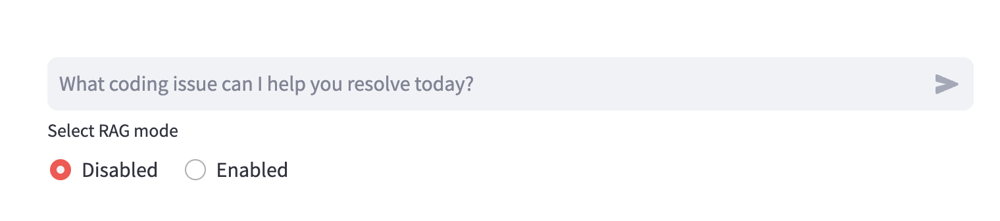
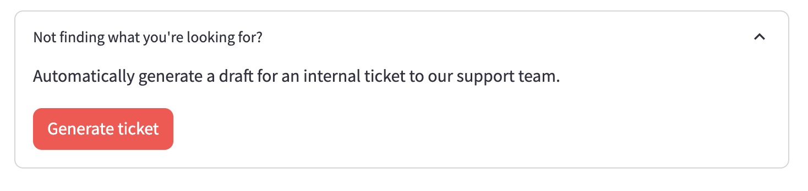
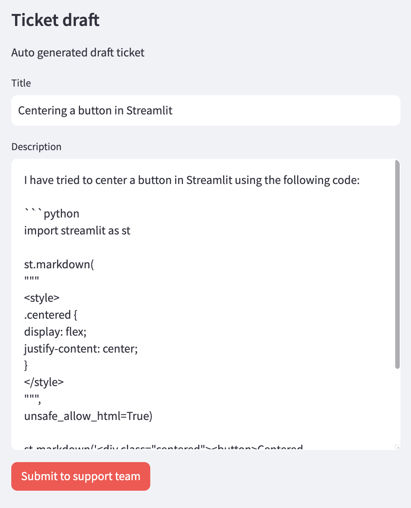
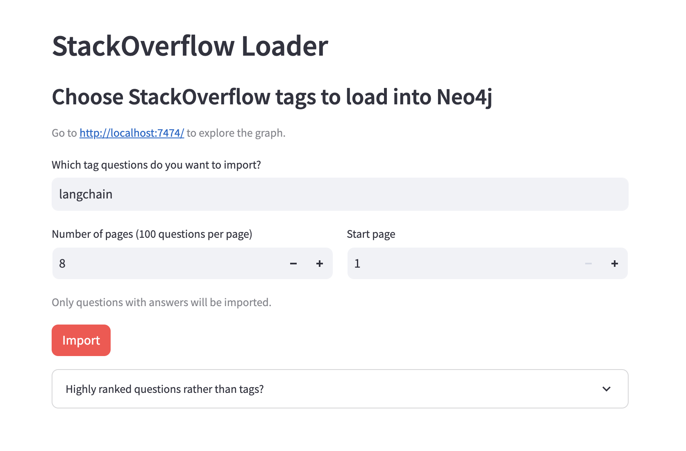
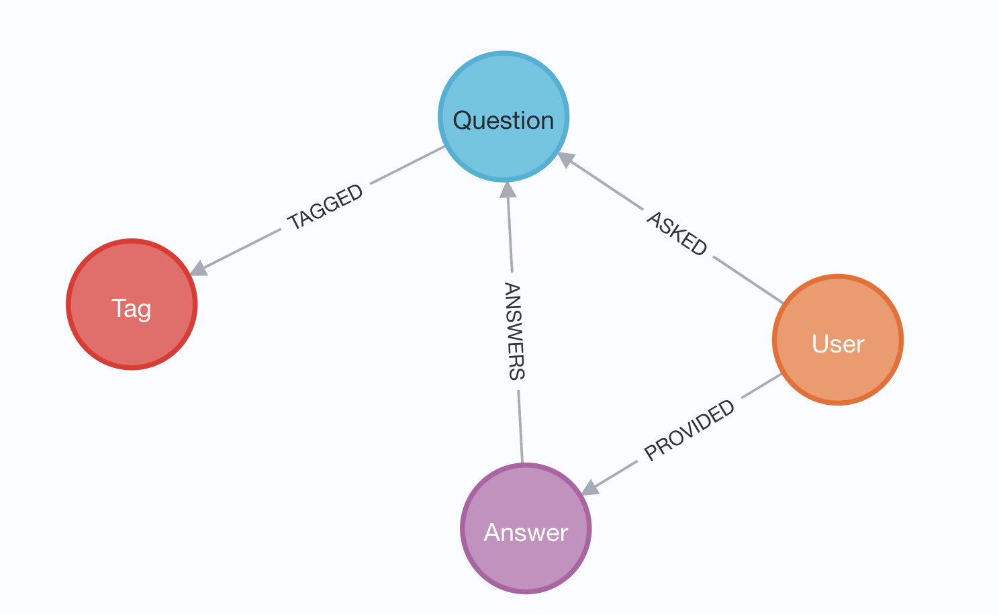
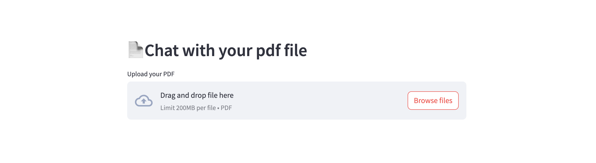
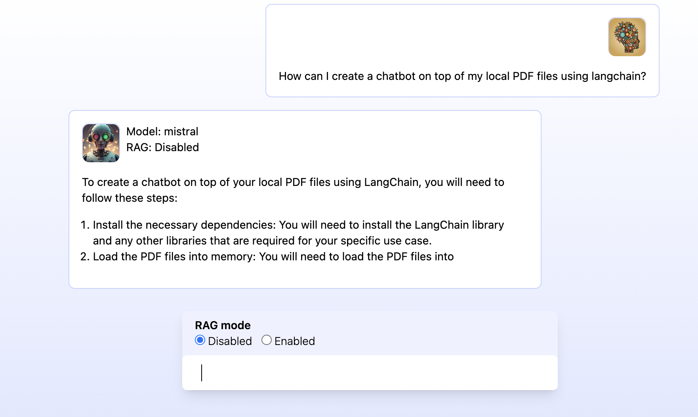

# GenAI Stack
The GenAI Stack will get you started building your own GenAI application in no time.
The demo applications can serve as inspiration or as a starting point.
Learn more about the details in the [introduction blog post](https://neo4j.com/blog/introducing-genai-stack-developers/).

# Configure

Create a `.env` file from the environment template file `env.example`

Available variables:
| Variable Name          | Default value                      | Description                                                             |
|------------------------|------------------------------------|-------------------------------------------------------------------------|
| OLLAMA_BASE_URL        | http://host.docker.internal:11434  | REQUIRED - URL to Ollama LLM API                                        |   
| NEO4J_URI              | neo4j://database:7687              | REQUIRED - URL to Neo4j database                                        |
| NEO4J_USERNAME         | neo4j                              | REQUIRED - Username for Neo4j database                                  |
| NEO4J_PASSWORD         | password                           | REQUIRED - Password for Neo4j database                                  |
| LLM                    | llama2                             | REQUIRED - Can be any Ollama model tag, or gpt-4 or gpt-3.5 or claudev2 |
| EMBEDDING_MODEL        | sentence_transformer               | REQUIRED - Can be sentence_transformer, openai, aws, ollama or google-genai-embedding-001|
| AWS_ACCESS_KEY_ID      |                                    | REQUIRED - Only if LLM=claudev2 or embedding_model=aws                  |
| AWS_SECRET_ACCESS_KEY  |                                    | REQUIRED - Only if LLM=claudev2 or embedding_model=aws                  |
| AWS_DEFAULT_REGION     |                                    | REQUIRED - Only if LLM=claudev2 or embedding_model=aws                  |
| OPENAI_API_KEY         |                                    | REQUIRED - Only if LLM=gpt-4 or LLM=gpt-3.5 or embedding_model=openai   |
| GOOGLE_API_KEY         |                                    | REQUIRED - Only required when using GoogleGenai LLM or embedding model google-genai-embedding-001|
| LANGCHAIN_ENDPOINT     | "https://api.smith.langchain.com"  | OPTIONAL - URL to Langchain Smith API                                   |
| LANGCHAIN_TRACING_V2   | false                              | OPTIONAL - Enable Langchain tracing v2                                  |
| LANGCHAIN_PROJECT      |                                    | OPTIONAL - Langchain project name                                       |
| LANGCHAIN_API_KEY      |                                    | OPTIONAL - Langchain API key                                            |

## LLM Configuration
MacOS and Linux users can use any LLM that's available via Ollama. Check the "tags" section under the model page you want to use on https://ollama.ai/library and write the tag for the value of the environment variable `LLM=` in the `.env` file.
All platforms can use GPT-3.5-turbo and GPT-4 (bring your own API keys for OpenAI models).

**MacOS**
Install [Ollama](https://ollama.ai) on MacOS and start it before running `docker compose up` using `ollama serve` in a separate terminal.

**Linux**
No need to install Ollama manually, it will run in a container as
part of the stack when running with the Linux profile: run `docker compose --profile linux up`.
Make sure to set the `OLLAMA_BASE_URL=http://llm:11434` in the `.env` file when using Ollama docker container.

To use the Linux-GPU profile: run `docker compose --profile linux-gpu up`. Also change `OLLAMA_BASE_URL=http://llm-gpu:11434` in the `.env` file.

**Windows**
Ollama now supports Windows. Install [Ollama](https://ollama.ai) on Windows and start it before running `docker compose up` using `ollama serve` in a separate terminal. Alternatively, Windows users can generate an OpenAI API key and configure the stack to use `gpt-3.5` or `gpt-4` in the `.env` file.
# Develop

> [!WARNING]
> There is a performance issue that impacts python applications in the `4.24.x` releases of Docker Desktop. Please upgrade to the latest release before using this stack.

**To start everything**
```
docker compose up
```
If changes to build scripts have been made, **rebuild**.
```
docker compose up --build
```

To enter **watch mode** (auto rebuild on file changes).
First start everything, then in new terminal:
```
docker compose watch
```

**Shutdown**
If health check fails or containers don't start up as expected, shutdown
completely to start up again.
```
docker compose down
```

# Applications

Here's what's in this repo:

| Name | Main files | Compose name | URLs | Description |
|---|---|---|---|---|
| Support Bot | `bot.py` | `bot` | http://localhost:8501 | Main usecase. Fullstack Python application. |
| Stack Overflow Loader | `loader.py` | `loader` | http://localhost:8502 | Load SO data into the database (create vector embeddings etc). Fullstack Python application. |
| PDF Reader | `pdf_bot.py` | `pdf_bot` | http://localhost:8503 | Read local PDF and ask it questions. Fullstack Python application. |
| Standalone Bot API | `api.py` | `api` | http://localhost:8504 | Standalone HTTP API streaming (SSE) + non-streaming endpoints Python. |
| Standalone Bot UI | `front-end/` | `front-end` | http://localhost:8505 | Standalone client that uses the Standalone Bot API to interact with the model. JavaScript (Svelte) front-end. |

The database can be explored at http://localhost:7474.

## App 1 - Support Agent Bot

UI: http://localhost:8501
DB client: http://localhost:7474

- answer support question based on recent entries
- provide summarized answers with sources
- demonstrate difference between
    - RAG Disabled (pure LLM response)
    - RAG Enabled (vector + knowledge graph context)
- allow to generate a high quality support ticket for the current conversation based on the style of highly rated questions in the database.


*(Chat input + RAG mode selector)*

|  |  |
|---|---|
|  |  |
| *(CTA to auto generate support ticket draft)* | *(UI of the auto generated support ticket draft)* |

---

##  App 2 - Loader

UI: http://localhost:8502
DB client: http://localhost:7474

- import recent Stack Overflow data for certain tags into a KG
- embed questions and answers and store them in vector index
- UI: choose tags, run import, see progress, some stats of data in the database
- Load high ranked questions (regardless of tags) to support the ticket generation feature of App 1.


|  |  |
|---|---|
|  |  |

## App 3 Question / Answer with a local PDF
UI: http://localhost:8503  
DB client: http://localhost:7474

This application lets you load a local PDF into text
chunks and embed it into Neo4j so you can ask questions about
its contents and have the LLM answer them using vector similarity
search.



## App 4 Standalone HTTP API
Endpoints: 
  - http://localhost:8504/query?text=hello&rag=false (non streaming)
  - http://localhost:8504/query-stream?text=hello&rag=false (SSE streaming)

Example cURL command:
```bash
curl http://localhost:8504/query-stream\?text\=minimal%20hello%20world%20in%20python\&rag\=false
```

Exposes the functionality to answer questions in the same way as App 1 above. Uses
same code and prompts.

## App 5 Static front-end
UI: http://localhost:8505

This application has the same features as App 1, but is built separate from
the back-end code using modern best practices (Vite, Svelte, Tailwind).  
The auto-reload on changes are instant using the Docker watch `sync` config.  

