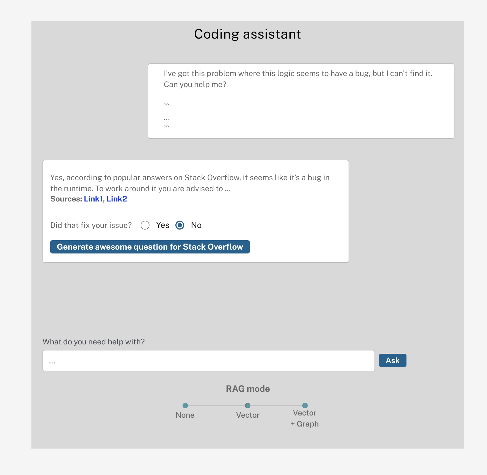

# LangChain Docker Starter Kits


# Configuration

Use an `.env` file for the OPENAI_API_KEY (see `env.example`)

# Develop
**To start everything**
```
docker compose up
```
If changes to build scripts has been made, **rebuild**
```
docker compose up --build
```

To enter **watch mode** (auto rebuild on file changes).  
First start everything, then in new terminal:
```
docker compose alpha watch
```

**Shutdown**  
Is health check fails or containers doesn't start up as expected, shutdown
completely to start up again.
```
docker compose down
```

# Applications
## App 1 - Support Agent Bot  

UI: http://localhost:8501

- answer support question based on recent entries
- provide summarized answers with sources
- demonstrate difference between
    - pure LLM
    - LLM + RAG (vector)
    - LLM + RAG (vector + knowledge graph context)
- allow to generate an great SO question for the current conversation based on the style of highly rated questions in the database

  
*(not actual UI, just showing the concept)*

--- 

##  App 2 Loader

UI: http://localhost:8502  
DB client: http://localhost:7474

- import recent (last weeks/months) SO data for certain tags into a KG
- embed questions and answers and store in vector index
- UI: choose tags, run import, see progress, some stats of data in the database

  


---

## App 3 Summarization / generation tasks

UI: TBD

- instead of just having the links to the original sources also demonstrate the following on the base data
- summarized version of the linked question, all it's answers and comments
    - as a bullet list
    - as a chain of thought
    - as a GitHub issue
    - as a fairy tale (fun)
    - as a poem (fun)
    - as a TIL blog post (markdown)
    - as a report / chart / graph?

